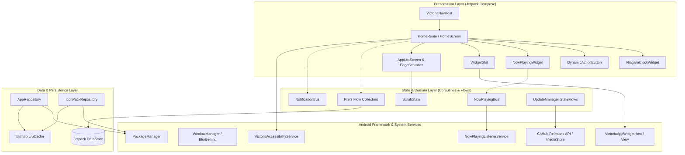

# Architecture of Victoria Launcher

Victoria Launcher is a single-module Android home-screen launcher built with Kotlin, Jetpack Compose, `minSdk 26`, and `compileSdk`/`targetSdk 35`. It is privacy-first: no ads, no analytics, no trackers, and no user accounts.

---

## 🏗️ High-Level System Architecture



---

## 📦 Package Layout (`dev.victorialauncher`)

```
dev.victorialauncher
├── MainActivity.kt                      Activity, window insets, status-bar peek, update receivers
├── VictoriaApp.kt                       Application singleton; initializes repositories, Prefs, widget host
├── data/
│   ├── AppInfo.kt                       Component name + label; flattened key representation
│   ├── AppRepository.kt                 PackageManager querying, launch intents, package change receivers
│   ├── Folder.kt                        Folder data model + JSON persistence + tokenized favorites
│   ├── HomePaddings.kt                  Vertical and horizontal padding slots
│   ├── IconPackRepository.kt            Icon-pack discovery, appfilter.xml parsing, drawable resolution
│   └── Prefs.kt                         DataStore<Preferences> schema, atomic flows, reactive keys
├── media/
│   ├── NowPlayingBus.kt                 Central state holder for active media sessions
│   ├── NowPlayingListenerService.kt     NotificationListenerService tracking MediaSessions & playback
│   └── NowPlayingWidget.kt              Now Playing card, transport controls, album art, swipe to dismiss
├── notification/
│   └── NotificationBus.kt               Notification bus bridging active messages to the UI layer
├── service/
│   ├── HapticUtil.kt                    VibrationEffect tick generator respecting system feedback settings
│   ├── StatusBarFader.kt                Window inset animator for peek status bar behavior
│   ├── SystemUi.kt                      System UI flags and status bar visibility controls
│   └── VictoriaAccessibilityService.kt  Sanctioned service for screen locking and shade expansion
├── ui/
│   ├── VictoriaNavHost.kt               Global navigation graph, collects preferences once
│   ├── applist/
│   │   ├── AppListModel.kt              Flattens installed apps into headers and items
│   │   ├── AppListScreen.kt             A-Z list overlay with real-time search, pull-to-collapse
│   │   ├── EdgeScrubber.kt              The A-Z strip that dynamically bows along a Gaussian curve
│   │   ├── EdgeTouchZone.kt             Invisible edge touch interception zone
│   │   ├── ScrubState.kt                Isolated scrub state holder preventing unnecessary recomposition
│   │   └── ScrubberGeometry.kt          Single source of truth for glyph positioning and amplitude
│   ├── common/
│   │   ├── AppIcon.kt                   Off-main-thread icon rasterization and byte-bounded LruCache
│   │   ├── AppMenuDialog.kt             Contextual long-press actions menu (options, info, uninstall)
│   │   ├── EditAppDialog.kt             Custom app name and icon picker modal
│   │   ├── FolderIconImage.kt           Composed 2x2 folder thumbnail or single icon
│   │   ├── FolderPickerDialog.kt        Folder selection modal
│   │   ├── IconPickerScreen.kt          Icon selection from installed icon packs
│   │   └── TouchPosition.kt             Non-consuming touch-position coordinate recorder
│   ├── home/
│   │   ├── DynamicActionButton.kt       Physical action button with tanh resistance and roller transitions
│   │   ├── FolderFloatingDialog.kt      Frosted-glass floating folder popup with blur behind
│   │   ├── HomeOptionsBottomSheet.kt    Monet-tinted bottom sheet (settings, wallpaper, widgets)
│   │   ├── HomeRoute.kt                 Orchestrates screen, app list overlay, gesture touch zones
│   │   ├── HomeScreen.kt                Unified alignment layout, edit mode reordering, favorites, clock
│   │   ├── NiagaraClockWidget.kt        6 clock styles, date ticks, system Clock & Calendar app intents
│   │   ├── ScreenOffEffect.kt           Visual fade transition for double-tap-to-lock
│   │   └── UpdateChangelogDialog.kt     Markdown release notes modal with direct download button
│   ├── notification/
│   │   └── NotificationDetailDialog.kt  Frosted-glass notification dialog with conversation thread history
│   ├── settings/
│   │   ├── ClockStylePickerScreen.kt    Visual picker for the 6 home clock styles
│   │   ├── DynamicButtonSettingsScreen.kt Configuration of Click, Swipe Up and Swipe Down actions
│   │   ├── FolderAppsScreen.kt          Folder membership management
│   │   ├── HiddenAppsScreen.kt          Toggle hidden apps
│   │   ├── Labels.kt                    User-facing setting labels
│   │   ├── ManageFavoritesScreen.kt     Drag-and-drop reordering of home screen favorites
│   │   └── SettingsScreen.kt            Categorized settings hierarchy
│   └── theme/
│       ├── ContentColor.kt              Wallpaper luminance sampling and automatic text contrast
│       └── Theme.kt                     Material You Monet engine, dynamic surface and border colors
├── update/
│   └── UpdateManager.kt                 GitHub Releases polling, download via MediaStore, notifications
└── widget/
    ├── LongPressFrameLayout.kt          Touch event arbiter for embedded Android widgets
    ├── VictoriaAppWidgetHost.kt         AppWidgetHost and VictoriaAppWidgetHostView (zero-padding enforcement)
    ├── WidgetPickerActivity.kt          System widget picker integration
    └── WidgetSlot.kt                    Widget container, dynamic resizing handles, long-press menu
```

---

## 💡 Architecture Decisions & Non-Obvious Constraints

### 1. Transparent System Wallpaper Window
The launcher **never draws the wallpaper**. `Theme.VictoriaLauncher` sets `android:windowShowWallpaper = true` with a transparent background. The real system wallpaper (including live wallpapers) renders directly through the window compositor. "Dim wallpaper" is simply a scrim `Box`, requiring zero bitmap memory.

### 2. Touch Arbitration with Android Widgets (`LongPressFrameLayout`)
Compose pointer inputs claim exclusive ownership of the touch stream once tracked, which would break touch buttons inside hosted Android widgets (such as music playback buttons). `LongPressFrameLayout` uses Android's traditional `onInterceptTouchEvent` pattern: it monitors touches on `ACTION_DOWN` without intercepting, only stealing the touch stream if its long-press timer expires.

### 3. Suppression of Framework Widget Padding (`VictoriaAppWidgetHostView`)
Since Android 4.0 (API 14), Android's standard `AppWidgetHostView` automatically calculates default system padding (`getDefaultPaddingForWidget`) and sets it on itself. Because Victoria Launcher manages precise margin boundaries via Compose (`contentStart` and `contentEnd`), `VictoriaAppWidgetHostView` overrides `setPadding(0, 0, 0, 0)` so widgets align flush with the clock, apps, and now playing controls.

### 4. Gaussian Bowing Without Glyph Scaling (`EdgeScrubber`)
Scaling font glyphs during fast dragging causes pixelation and font cache thrashing. `EdgeScrubber` translates each letter along a Gaussian curve on the X axis without changing its font scale. Touch positions arrive as lambdas executed inside `Modifier.graphicsLayer { ... }`, evaluating purely during the draw phase and bypassing the recomposition phase.

### 5. Non-Consuming Touch Position Recorder (`recordTouchPosition`)
To open context menus at the exact fingertip coordinates without consuming the `ACTION_DOWN` event (which would break vertical scrolling and dragging gestures), `recordTouchPosition` observes pointer coordinates passively without calling `consume()`.

### 6. Off-Screen Layout Preservation
The app-list overlay stays composed while hidden. It is measured but not placed (`layout(0, 0) {}`), rendering nothing to screen and consuming no GPU resources. When summoned, it appears instantaneously without initial composition lag.

---

## ⚡ Performance and Recomposition Isolation

- **Stable State Holder (`ScrubState`):** Emits letter changes through a single stable state holder object. Components observing the current letter recompose locally without re-evaluating the parent `HomeRoute`.
- **Byte-Bounded Bitmap `LruCache`:** Icons are cached by byte size rather than entry count (`Runtime.getRuntime().maxMemory() / 8`). The cache key includes target pixel dimensions (`key#sizePx`), preventing out-of-memory errors when the user adjusts the icon size slider.

---

## 🔐 Permissions and Security

| Permission | Purpose | Optional? |
|---|---|---|
| `QUERY_ALL_PACKAGES` | Enumerate installed applications, icon packs, and widget providers on Android 11+ (API 30+). | No |
| `INTERNET` | Check GitHub Releases API for updates and download signed APK releases. | No |
| `POST_NOTIFICATIONS` | Send non-intrusive update notification alerts on Android 13+ (API 33+). | Optional (System prompt) |
| `REQUEST_INSTALL_PACKAGES` | Trigger the Android PackageInstaller to install downloaded APK updates. | Optional (Granted per install) |
| `VIBRATE` | Precise linear haptic feedback ticks during letter navigation. | No |
| `EXPAND_STATUS_BAR` | Expand the notification shade via gesture. | No |
| `BIND_ACCESSIBILITY_SERVICE` | Sanctioned API to lock the screen (double-tap) and expand notifications without reflection. | Optional (Accessibility settings) |
| `BIND_NOTIFICATION_LISTENER_SERVICE` | Read active media playback for Now Playing and capture unread message notifications. | Optional (Settings prompt) |

---

## 📚 Specialized Documentation

- [Features Guide (`docs/FEATURES_GUIDE.md`)](FEATURES_GUIDE.md): Comprehensive functional specification of all launcher features.
- [Theming & UI (`docs/THEMING_AND_UI.md`)](THEMING_AND_UI.md): Monet dynamic colors, frosted glass tinting, blur flags, and typography.
- [Update System (`docs/UPDATE_SYSTEM.md`)](UPDATE_SYSTEM.md): Built-in updater architecture, background downloads, and release workflows.
- [Data & Storage (`docs/DATA_AND_STORAGE.md`)](DATA_AND_STORAGE.md): DataStore preferences, serialization, repositories, and memory caching.
