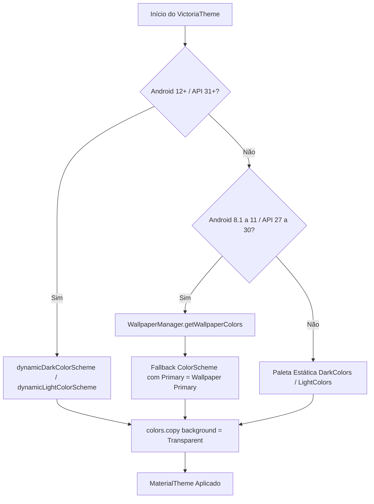

# 🎨 Sistema de Design, Cores Dinâmicas (Monet) e Interface do Victoria Launcher

Este documento detalha as decisões de design, a engenharia de cores dinâmicas (Material You / Monet), o modelo de superfícies vítreas translúcidas (*frosted glass*), a tipografia e os efeitos visuais implementados no **Victoria Launcher**.

---

## 📑 Sumário

1. [Filosofia Visual e Janelas Transparentes](#1-filosofia-visual-e-janelas-transparentes)
2. [Motor Monet e Extração de Cores do Wallpaper](#2-motor-monet-e-extração-de-cores-do-wallpaper)
3. [Tingimento Dinâmico de Superfícies (`dynamicSurfaceColor`)](#3-tingimento-dinâmico-de-superfícies-dynamicsurfacecolor)
4. [Bordas Adaptativas com Brilho do Sistema (`dynamicBorderColor`)](#4-bordas-adaptativas-com-brilho-do-sistema-dynamicbordercolor)
5. [Desfoque Nativo de Janela (`FLAG_BLUR_BEHIND`)](#5-desfoque-nativo-de-janela-flag_blur_behind)
6. [Contraste e Modos de Cor de Texto](#6-contraste-e-modos-de-cor-de-texto)
7. [Sistema Tipográfico](#7-sistema-tipográfico)
8. [Engenharia Tátil e Micro-interações](#8-engenharia-tátil-e-micro-interações)
9. [Ícones Temáticos Dinâmicos do Monet (Geração Própria)](#9-ícones-temáticos-dinâmicos-do-monet-geração-própria)

---

## 1. Filosofia Visual e Janelas Transparentes

Diferente de launchers convencionais que desenham um bitmap do papel de parede dentro de sua própria visualização, o Victoria Launcher adota a flag nativa do sistema operacional:

```xml
<item name="android:windowShowWallpaper">true</item>
<item name="android:windowBackground">@android:color/transparent</item>
```

### Vantagens dessa Abordagem:
- **Zero Consumo de Memória Bitmap:** O launcher não aloca texturas extras de tela cheia na GPU para exibir o papel de parede.
- **Suporte Nativo a Live Wallpapers:** Papéis de parede animados, vídeos ou shaders interativos rodam diretamente pelo servidor de janelas do Android sem overhead.
- **Efeito Dimming sem Processamento de Imagem:** O escurecimento do wallpaper ("Dim wallpaper") é simplesmente uma camada `Box` com `Color.Black.copy(alpha = dimAlpha)`, sem necessidade de shaders complexos de pixel.

---

## 2. Motor Monet e Extração de Cores do Wallpaper

O Victoria Launcher implementa integração dinâmica com a paleta de cores do usuário, adaptando-se do **Android 8.1 (API 27) ao Android 15+ (API 35)**.



### Implementação ([`Theme.kt`](file:///data/data/com.termux/files/home/storage/kotlin_projects/launcher/victoria-launcher/app/src/main/java/dev/victorialauncher/ui/theme/Theme.kt)):
- **Android 12+ (Material You):** Carrega os tons tonais do sistema operacional através de `dynamicDarkColorScheme(context)` ou `dynamicLightColorScheme(context)`.
- **Android 8.1 a 11 (Fallback com WallpaperManager):** Extrai a cor primária dominante do papel de parede via:
  ```kotlin
  val wm = WallpaperManager.getInstance(context)
  wm.getWallpaperColors(WallpaperManager.FLAG_SYSTEM)?.primaryColor?.toArgb()?.let { Color(it) }
  ```
  Essa cor é injetada na paleta como a cor `primary` e `primaryContainer`, garantindo que usuários em versões anteriores do Android também tenham uma experiência visualmente personalizada.

---

## 3. Tingimento Dinâmico de Superfícies (`dynamicSurfaceColor`)

Muitas interfaces modernas falham ao apresentar diálogos em tons de cinza estáticos e neutros, desvinculando visualmente a janela do papel de parede que está logo atrás.

No Victoria Launcher, o algoritmo `dynamicSurfaceColor` aplica interpolação linear (`lerp`) entre o container de superfície do Material 3 e a cor primária dinâmica Monet:

```kotlin
@Composable
fun dynamicSurfaceColor(
    alpha: Float = 0.90f,
    tintFraction: Float = 0.12f,
): Color {
    val colorScheme = MaterialTheme.colorScheme
    return lerp(colorScheme.surfaceContainerHigh, colorScheme.primary, tintFraction).copy(alpha = alpha)
}
```

### Onde é Utilizado:
- Diálogo de Opções da Tela Inicial ([`HomeOptionsBottomSheet.kt`](file:///data/data/com.termux/files/home/storage/kotlin_projects/launcher/victoria-launcher/app/src/main/java/dev/victorialauncher/ui/home/HomeOptionsBottomSheet.kt)).
- Menu de Contexto do Aplicativo ([`AppMenuDialog.kt`](file:///data/data/com.termux/files/home/storage/kotlin_projects/launcher/victoria-launcher/app/src/main/java/dev/victorialauncher/ui/common/AppMenuDialog.kt)).
- Janela Flutuante de Pastas ([`FolderFloatingDialog.kt`](file:///data/data/com.termux/files/home/storage/kotlin_projects/launcher/victoria-launcher/app/src/main/java/dev/victorialauncher/ui/home/FolderFloatingDialog.kt)).
- Diálogo de Atualização e Mudanças ([`UpdateChangelogDialog.kt`](file:///data/data/com.termux/files/home/storage/kotlin_projects/launcher/victoria-launcher/app/src/main/java/dev/victorialauncher/ui/home/UpdateChangelogDialog.kt)).
- Detalhes de Notificações ([`NotificationDetailDialog.kt`](file:///data/data/com.termux/files/home/storage/kotlin_projects/launcher/victoria-launcher/app/src/main/java/dev/victorialauncher/ui/notification/NotificationDetailDialog.kt)).

---

## 4. Bordas Adaptativas com Brilho do Sistema (`dynamicBorderColor`)

Para delimitar as superfícies translúcidas sem depender de sombras projetadas (drop shadows) pesadas, foi desenvolvido o componente de borda dinâmico:

```kotlin
@Composable
fun dynamicBorderColor(
    alpha: Float = 0.35f,
    tintFraction: Float = 0.40f,
): Color {
    val colorScheme = MaterialTheme.colorScheme
    return lerp(colorScheme.outlineVariant, colorScheme.primary, tintFraction).copy(alpha = alpha)
}
```

Essa borda sutil de 1dp confere sensação tátil de profundidade óptica (*glassmorphism*), capturando a luz ambiente refletida pelo papel de parede.

---

## 5. Desfoque Nativo de Janela (`FLAG_BLUR_BEHIND`)

No Android 12+ (API 31+), as janelas flutuantes ativam o suporte nativo de desfoque por hardware através do WindowManager:

```kotlin
dialog.window?.let { window ->
    window.addFlags(WindowManager.LayoutParams.FLAG_BLUR_BEHIND)
    if (Build.VERSION.SDK_INT >= Build.VERSION_CODES.S) {
        window.attributes.blurBehindRadius = 32 // Desfoque suave em tempo real
    }
}
```

Isso garante que o conteúdo da tela inicial fique artisticamente desfocado ao fundo enquanto o usuário interage com um menu, pasta ou notificação.

---

## 6. Contraste e Modos de Cor de Texto

O arquivo [`ContentColor.kt`](file:///data/data/com.termux/files/home/storage/kotlin_projects/launcher/victoria-launcher/app/src/main/java/dev/victorialauncher/ui/theme/ContentColor.kt) calcula dinamicamente a cor ideal do texto para garantir legibilidade sobre qualquer imagem de fundo:

- **`TextColorMode.LIGHT`:** Força texto branco com ligeira sombra semântica para papéis de parede escuros.
- **`TextColorMode.DARK`:** Força texto escuro/preto para papéis de parede claros.
- **`TextColorMode.AUTO`:** Lê a luminância média das cores extraídas pelo `WallpaperManager` e seleciona automaticamente o esquema que oferece maior taxa de contraste (atendendo às diretrizes de acessibilidade WCAG 2.1).

---

## 7. Sistema Tipográfico

O usuário pode escolher entre 4 famílias tipográficas essenciais ([`AppFont`](file:///data/data/com.termux/files/home/storage/kotlin_projects/launcher/victoria-launcher/app/src/main/java/dev/victorialauncher/data/Prefs.kt)):

| Identificador | `FontFamily` Android | Característica |
|---|---|---|
| `SYSTEM` | `FontFamily.Default` | Fonte padrão do sistema (Roboto, Google Sans, Samsung One, etc.) |
| `SANS_SERIF` | `FontFamily.SansSerif` | Limpa, moderna e altamente legível em telas de alta densidade |
| `SERIF` | `FontFamily.Serif` | Elegante, editorial e sofisticada |
| `MONOSPACE` | `FontFamily.Monospace` | Técnica e precisa |

A fonte selecionada propaga-se de forma homogênea por todas as variantes de texto do Compose (`titleLarge`, `bodyLarge`, `labelLarge`, etc.).

---

## 8. Engenharia Tátil e Micro-interações

A experiência física do launcher é acentuada por feedback tátil proporcional:

- **[`HapticUtil.kt`](file:///data/data/com.termux/files/home/storage/kotlin_projects/launcher/victoria-launcher/app/src/main/java/dev/victorialauncher/service/HapticUtil.kt):** Utiliza a API `VibrationEffect.createPredefined(EFFECT_TICK)` em dispositivos compatíveis, respeitando a configuração global do sistema e a opção dedicada nas preferências do launcher.
- **Física de Molas (Spring Physics):** Os elementos utilizam curvas de mola (`Spring.DampingRatioMediumBouncy`) para retornar suavemente à posição original após gestos de arrasto.

---

## 9. Ícones Temáticos Dinâmicos do Monet (Geração Própria)

A Victoria Launcher inclui um motor nativo de geração de ícones temáticos (`ThemedAppIcon`) baseado no Material You / Monet, desenhado para abranger **100% dos aplicativos instalados**:

### Arquitetura de Geração e Extração:
1. **Camada Monocromática Oficial (Android 13+):** Extrai a camada `AdaptiveIconDrawable.monochrome` quando disponível nativamente.
2. **Extração Inteligente de Contorno (`stripCornerBackground`):** Para apps sem camada monocromática dedicada, a launcher analisa os cantos do foreground e ícones legados. Se os cantos forem predominantemente opacos, detecta a cor do fundo e remove-a cirurgicamente via cálculo de distância euclidiana, isolando o glifo/emblema central.
3. **Máscara de Contraste e Luminância (`convertToWhiteMask`):** Processamento em escala de cinza com normalização de luminância e ponderação quadrática de alfa para manter a legibilidade, relevo e detalhes internos de logotipos complexos.
4. **Monograma Material (Fallback Universal):** Caso um ícone seja plano, monocromático ou corrompido, gera automaticamente um monograma refinado com a inicial do aplicativo em tipografia bold.

### Estilos Visuais Suportados:
- **`MATERIAL_YOU` (Padrão):** Recipiente adaptativo em formato squircle (arredondamento harmônico a 28%), preenchido com `secondaryContainer` do Monet e glifo centralizado com destaque `primary`.
- **`MINIMALIST`:** Glifo vazado sem recipiente, tingido na cor `primary` do wallpaper.

### Otimização e Cache GPU:
- As máscaras monocromáticas são cacheadas em `IconCache` como bitmaps de alfa puros (independentes de cor).
- O tingimento dinâmico é efetuado pelos shaders da GPU no Compose (`BlendMode.SrcIn`). Mudanças de papel de parede ou alternâncias claro/escuro atualizam todos os ícones instantaneamente em tempo real.

