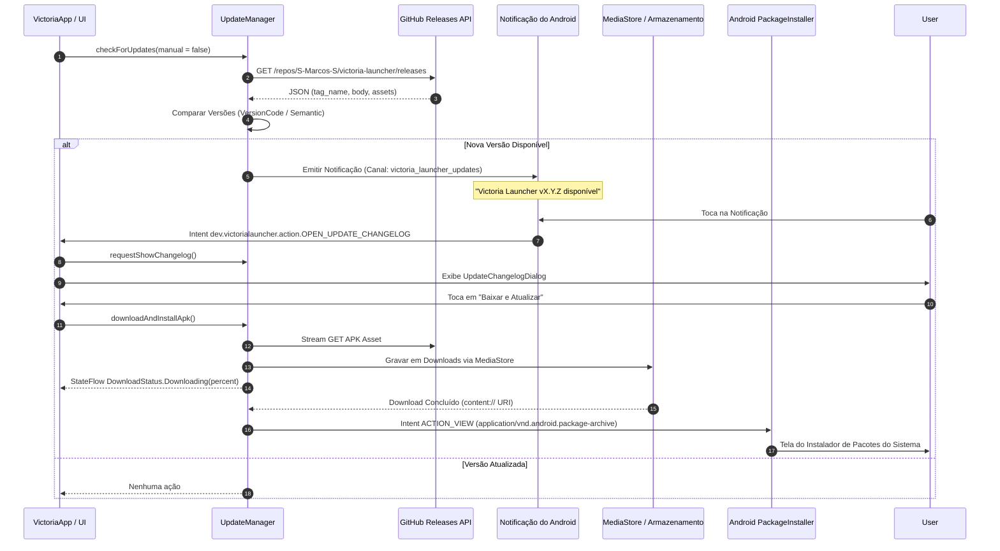

# 🔄 Sistema de Atualização Integrada do Victoria Launcher

Este documento descreve a arquitetura, o fluxo de dados, a camada de rede e a experiência do usuário do sistema de atualizações integradas (**In-App Updates**) do **Victoria Launcher**.

---

## 📑 Sumário

1. [Visão Geral da Arquitetura](#1-visão-geral-da-arquitetura)
2. [Fluxo de Execução de Atualização](#2-fluxo-de-execução-de-atualização)
3. [Notificações Não Intrusivas do Sistema](#3-notificações-não-intrusivas-do-sistema)
4. [Diálogo de Mudanças ("O que há de novo")](#4-diálogo-de-mudanças-o-que-há-de-novo)
5. [Pipeline de Download via MediaStore e FileProvider](#5-pipeline-de-download-via-mediastore-e-fileprovider)
6. [Integração com PackageInstaller do Android](#6-integração-com-packageinstaller-do-android)
7. [Otimização de Bateria e Cache Inteligente](#7-otimização-de-bateria-e-cache-inteligente)
8. [Diretriz de Changelog Pré-Build (GEMINI.md)](#8-diretriz-de-changelog-pré-build-geminimd)

---

## 1. Visão Geral da Arquitetura

O sistema de atualização permite que o Victoria Launcher descubra novas versões compiladas pelo GitHub Actions, alerte o usuário de maneira discreta, baixe o APK assinado diretamente pela internet e solicite a instalação sem depender da Google Play Store.

### Arquivos Principais:
- [`UpdateManager.kt`](file:///data/data/com.termux/files/home/storage/kotlin_projects/launcher/victoria-launcher/app/src/main/java/dev/victorialauncher/update/UpdateManager.kt): Objeto singleton (`UpdateManager`) que encapsula requisições à API do GitHub, gerenciamento de notificações, streaming de download e disparo do instalador de pacotes.
- [`UpdateChangelogDialog.kt`](file:///data/data/com.termux/files/home/storage/kotlin_projects/launcher/victoria-launcher/app/src/main/java/dev/victorialauncher/ui/home/UpdateChangelogDialog.kt): Modal translúcido com renderização de markdown que exibe as notas de versão e o progresso em tempo real.
- [`MainActivity.kt`](file:///data/data/com.termux/files/home/storage/kotlin_projects/launcher/victoria-launcher/app/src/main/java/dev/victorialauncher/MainActivity.kt): Trata a permissão `POST_NOTIFICATIONS` e captura o `PendingIntent` de abertura do diálogo.

---

## 2. Fluxo de Execução de Atualização



---

## 3. Notificações Não Intrusivas do Sistema

Anteriormente, o diálogo de atualização surgia automaticamente na tela inicial, interrompendo o uso do launcher. 

Na arquitetura atual:
1. **Canal de Notificação Dedicado:** Criado em [`UpdateManager.kt`](file:///data/data/com.termux/files/home/storage/kotlin_projects/launcher/victoria-launcher/app/src/main/java/dev/victorialauncher/update/UpdateManager.kt):
   - ID: `victoria_launcher_updates`
   - Nome: `"Atualizações do Victoria Launcher"`
   - Importância: `IMPORTANCE_DEFAULT`
2. **Controle de Notificação Duplicada:** O `UpdateManager` armazena em SharedPreferences a chave da última versão notificada (`last_notified_update`), garantindo que o usuário receba apenas um aviso por nova versão.
3. **Acesso Direto sob Demanda:** Ao tocar na notificação, um `PendingIntent` com a flag `FLAG_UPDATE_CURRENT` e `FLAG_IMMUTABLE` ativa a `MainActivity`, abrindo imediatamente a janela de mudanças.

---

## 4. Diálogo de Mudanças ("O que há de novo")

O diálogo flutuante ([`UpdateChangelogDialog.kt`](file:///data/data/com.termux/files/home/storage/kotlin_projects/launcher/victoria-launcher/app/src/main/java/dev/victorialauncher/ui/home/UpdateChangelogDialog.kt)) possui as seguintes características:

- **Efeito Visual Glassmorphism:** Fundo translúcido com `dynamicSurfaceColor` e contorno suave com `dynamicBorderColor`.
- **Renderização Estruturada de Markdown:** Interpreta seções, cabeçalhos (`###`), listas com marcadores (`-`) e textos em negrito (`**`).
- **Indicador Dinâmico de Download:** Durante a transferência, exibe uma barra de progresso linear e porcentagem exata (`Downloading(progressPercent)`).
- **Botões de Ação:** 
  - *"Depois"*: Adia a atualização sem incômodo.
  - *"Baixar e Atualizar"*: Inicia o download e direciona para a instalação.

---

## 5. Pipeline de Download via MediaStore e FileProvider

O download dos arquivos APK suporta os modelos de armazenamento modernos e legados do Android:

```kotlin
// Android 10+ (API 29+): MediaStore API com Scoped Storage
val contentValues = ContentValues().apply {
    put(MediaStore.MediaColumns.DISPLAY_NAME, fileName)
    put(MediaStore.MediaColumns.MIME_TYPE, "application/vnd.android.package-archive")
    put(MediaStore.MediaColumns.RELATIVE_PATH, Environment.DIRECTORY_DOWNLOADS)
}
val uri = resolver.insert(MediaStore.Downloads.EXTERNAL_CONTENT_URI, contentValues)
```

- **Segurança de Streams:** O fluxo de entrada HTTP (`HttpURLConnection`) grava diretamente no `OutputStream` fornecido pelo `ContentResolver`.
- **Compatibilidade Legada (Android 8.0 e 9.0):** Em dispositivos anteriores ao Android 10, o arquivo é gravado no diretório público de Downloads ou no cache da aplicação e exposto via `FileProvider` (`${applicationId}.fileprovider`).

---

## 6. Integração com PackageInstaller do Android

Ao término do download, o launcher dispara o instalador oficial do Android:

```kotlin
val installIntent = Intent(Intent.ACTION_VIEW).apply {
    setDataAndType(apkUri, "application/vnd.android.package-archive")
    addFlags(Intent.FLAG_GRANT_READ_URI_PERMISSION)
    addFlags(Intent.FLAG_ACTIVITY_NEW_TASK)
}
context.startActivity(installIntent)
```

- **Permissão `REQUEST_INSTALL_PACKAGES`:** Declarada no manifesto para permitir que o launcher invoque a instalação de APKs baixados.

---

## 7. Otimização de Bateria e Cache Inteligente

Para evitar consumo desnecessário de dados móveis, bateria e limite de requisições da API pública do GitHub:
- **Janela de Cache de 20 Minutos:** O launcher impõe um intervalo mínimo de 20 minutos (`CHECK_INTERVAL_MS = 20 * 60 * 1000L`) para verificações silenciosas em segundo plano quando o usuário retorna à tela inicial.
- **Verificação Manual Instantânea:** No painel de opções da tela inicial (`HomeOptionsBottomSheet`), tocar em *"Verificar atualizações"* ignora a janela de cache e força uma consulta imediata ao GitHub.

---

## 8. Diretriz de Changelog Pré-Build (GEMINI.md)

Para alimentar com perfeição as notas de versão do `UpdateManager`, o projeto segue uma regra mandatória documentada no arquivo [`GEMINI.md`](file:///data/data/com.termux/files/home/storage/kotlin_projects/launcher/victoria-launcher/GEMINI.md):

> **Regra Obrigatória:** Toda alteração, recurso ou correção no código-fonte deve atualizar previamente o arquivo `CHANGELOG_LATEST.md` na raiz do repositório.

Esse arquivo é lido pelo workflow de compilação do GitHub Actions e inserido no corpo (body) da nova Release criada no repositório, garantindo que os usuários recebam detalhes precisos em português de todas as novidades.
